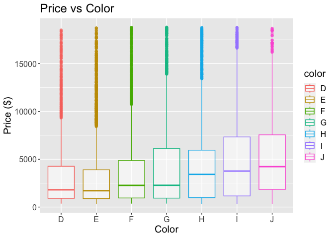

# Cubic Zirconia Price Analysis


# Introduction

The goal of this analysis is to explore the relationships between cubic
zirconia gemstone characteristics (e.g., `carat`, `cut`, `color`,
`clarity`) and price. The analysis emphasizes inference, focusing on
identifying significant predictors and understanding their relationships
while ensuring statistical rigor.

------------------------------------------------------------------------

``` r
# Load required libraries
library(tidyverse)
```

    ── Attaching core tidyverse packages ──────────────────────── tidyverse 2.0.0 ──
    ✔ dplyr     1.1.4     ✔ readr     2.1.4
    ✔ forcats   1.0.0     ✔ stringr   1.5.1
    ✔ ggplot2   3.4.4     ✔ tibble    3.2.1
    ✔ lubridate 1.9.3     ✔ tidyr     1.3.0
    ✔ purrr     1.0.2     
    ── Conflicts ────────────────────────────────────────── tidyverse_conflicts() ──
    ✖ dplyr::filter() masks stats::filter()
    ✖ dplyr::lag()    masks stats::lag()
    ℹ Use the conflicted package (<http://conflicted.r-lib.org/>) to force all conflicts to become errors

``` r
library(car) 
```

    Warning: package 'car' was built under R version 4.3.3

    Loading required package: carData

    Attaching package: 'car'

    The following object is masked from 'package:dplyr':

        recode

    The following object is masked from 'package:purrr':

        some

``` r
library(dplyr)
library(MASS) 
```


    Attaching package: 'MASS'

    The following object is masked from 'package:dplyr':

        select

``` r
library(gridExtra)
```


    Attaching package: 'gridExtra'

    The following object is masked from 'package:dplyr':

        combine

# Load the dataset

``` r
path <- "cubic_zirconia.csv"

data <- read_csv(file = path, col_names = TRUE)
```

    New names:
    Rows: 26967 Columns: 11
    ── Column specification
    ──────────────────────────────────────────────────────── Delimiter: "," chr
    (3): cut, color, clarity dbl (8): ...1, carat, depth, table, x, y, z, price
    ℹ Use `spec()` to retrieve the full column specification for this data. ℹ
    Specify the column types or set `show_col_types = FALSE` to quiet this message.
    • `` -> `...1`

``` r
head(data)
```

    # A tibble: 6 × 11
       ...1 carat cut       color clarity depth table     x     y     z price
      <dbl> <dbl> <chr>     <chr> <chr>   <dbl> <dbl> <dbl> <dbl> <dbl> <dbl>
    1     1  0.3  Ideal     E     SI1      62.1    58  4.27  4.29  2.66   499
    2     2  0.33 Premium   G     IF       60.8    58  4.42  4.46  2.7    984
    3     3  0.9  Very Good E     VVS2     62.2    60  6.04  6.12  3.78  6289
    4     4  0.42 Ideal     F     VS1      61.6    56  4.82  4.8   2.96  1082
    5     5  0.31 Ideal     F     VVS1     60.4    59  4.35  4.43  2.65   779
    6     6  1.02 Ideal     D     VS2      61.5    56  6.46  6.49  3.99  9502

Response Variable:

    Price : the Price of the cubic zirconia.

Possible Covariates:

    Carat : Carat weight of the cubic zirconia.

    Cut : Describe the cut quality of the cubic zirconia. Quality is increasing order Fair, Good, Very Good, Premium, Ideal.

    Color: Colour of the cubic zirconia.With D being the best and J the worst.

    Clarity : cubic zirconia Clarity refers to the absence of the Inclusions and Blemishes. (In order from Best to Worst, FL = flawless, I3= level 3 inclusions) - FL, IF, VVS1, VVS2, VS1, VS2, SI1, SI2, I1, I2, I3

    Depth : The Height of a cubic zirconia, measured from the Culet to the table, divided by its average Girdle Diameter.

    Table : The Width of the cubic zirconia's Table expressed as a percentage of its Average Diameter.

    X : Length of the cubic zirconia in mm.

    Y : Width of the cubic zirconia in mm.

    Z : Height of the cubic zirconia in mm.

# Clean the dataset

``` r
#Removing row count column
data <- data[-1]
head(data)
```

    # A tibble: 6 × 10
      carat cut       color clarity depth table     x     y     z price
      <dbl> <chr>     <chr> <chr>   <dbl> <dbl> <dbl> <dbl> <dbl> <dbl>
    1  0.3  Ideal     E     SI1      62.1    58  4.27  4.29  2.66   499
    2  0.33 Premium   G     IF       60.8    58  4.42  4.46  2.7    984
    3  0.9  Very Good E     VVS2     62.2    60  6.04  6.12  3.78  6289
    4  0.42 Ideal     F     VS1      61.6    56  4.82  4.8   2.96  1082
    5  0.31 Ideal     F     VVS1     60.4    59  4.35  4.43  2.65   779
    6  1.02 Ideal     D     VS2      61.5    56  6.46  6.49  3.99  9502

# Exploratory Data Analysis (EDA)

## Summary Statistics

``` r
print(str_glue ("There are {nrow(data)} rows in the dataset.\n\n"))
```

    There are 26967 rows in the dataset.

``` r
print(str_glue("There are {sum(is.na(data))} total missing values in the dataset.\n Total missing values per column:\n\n"))
```

    There are 697 total missing values in the dataset.
    Total missing values per column:

``` r
print(colSums(is.na(data)))
```

      carat     cut   color clarity   depth   table       x       y       z   price 
          0       0       0       0     697       0       0       0       0       0 

``` r
data <- data |> drop_na(depth)
print(colSums(is.na(data)))
```

      carat     cut   color clarity   depth   table       x       y       z   price 
          0       0       0       0       0       0       0       0       0       0 

# Correcting Column Data Types

``` r
data$cut <- factor(data$cut, levels = c("Ideal", "Premium", "Very Good", "Good", "Fair"))
data$color <- factor(data$color, levels = c("D", "E", "F", "G", "H", "I", "J"))
data$clarity <- factor(data$clarity, levels = c("FL", "IF", "VVS1", "VVS2", "VS1", "VS2", "SI1", "SI2", "I1", "I2", "I3"))

head(data)
```

    # A tibble: 6 × 10
      carat cut       color clarity depth table     x     y     z price
      <dbl> <fct>     <fct> <fct>   <dbl> <dbl> <dbl> <dbl> <dbl> <dbl>
    1  0.3  Ideal     E     SI1      62.1    58  4.27  4.29  2.66   499
    2  0.33 Premium   G     IF       60.8    58  4.42  4.46  2.7    984
    3  0.9  Very Good E     VVS2     62.2    60  6.04  6.12  3.78  6289
    4  0.42 Ideal     F     VS1      61.6    56  4.82  4.8   2.96  1082
    5  0.31 Ideal     F     VVS1     60.4    59  4.35  4.43  2.65   779
    6  1.02 Ideal     D     VS2      61.5    56  6.46  6.49  3.99  9502

## Distributions of Variables

``` r
# Function to calculate proportions and create a plot
create_proportion_plot <- function(var, var_name) {
  prop_table <- prop.table(table(var)) * 100
  prop_df <- as.data.frame(prop_table)
  colnames(prop_df) <- c(var_name, "proportion")
  
  ggplot(prop_df, aes(x = get(var_name), y = proportion)) +
    geom_bar(stat = "identity", fill = "purple", color = "white") +
    labs(x = var_name, y = "Proportion (%)", title = str_glue("Proportion of Categories in {str_to_title(var_name)}")) +
    theme_minimal() +
    theme(axis.text.x = element_text(angle = 45, hjust = 1),
         text = element_text(size = 15)) 
}

p1 <- create_proportion_plot(data$clarity, "clarity")
p2 <- create_proportion_plot(data$cut, "cut")
p3 <- create_proportion_plot(data$color, "color")

grid.arrange(p1, p2, p3, nrow = 1, ncol = 3, widths = c(8, 8, 8), heights = c(8))
```


The graphs above indicate that the categories within each categorical
variable are not equally represented in the data.

``` r
ggplot(data, aes(x = price)) + 
  geom_histogram(bins = 15, fill = "purple", color = "white") +
  labs(x = "Price ($)", y = "Count", title = "Price Distribution") + 
  theme(text = element_text(size = 16)) +
  geom_vline(aes(xintercept = mean(price), color = "Mean"), linetype = "dashed", size = 1) + 
  geom_vline(aes(xintercept = median(price), color = "Median"), linetype = "dashed", size = 1) + 
  scale_color_manual(values = c("Mean" = "red", "Median" = "blue")) +
  theme(legend.title = element_text(size = 14), legend.text = element_text(size = 12))
```

    Warning: Using `size` aesthetic for lines was deprecated in ggplot2 3.4.0.
    ℹ Please use `linewidth` instead.


The above histogram for the response variable, Price, shows a right
skewed distribution. The mean is higher than the median.

## Relationships Between Variables

``` r
# graphing all continuous variables against price (the response)

continuous_vars = c('carat', 'depth', 'table', 'x', 'y', 'z')
labels = c('Carat', 'Depth', 'Table (%)', 'Length (mm)', 'Width (mm)', 'Height (mm)')

plot_list <- list()

for (i in 1:length(continuous_vars)) {
    p <- ggplot(data = data, aes(x = .data[[continuous_vars[i]]], y = price)) +
            geom_point(color = "purple", alpha = 0.2) + 
            labs(x = labels[i], y = "Price ($)", title = str_glue("Price vs {stringr::str_to_title(continuous_vars[i])}")) + 
            theme(text = element_text(size = 12))
    plot_list[[i]] <- p
}

grid.arrange(grobs = plot_list, nrow = 3, col = 2)
```


todo

``` r
cat_vars = c('cut', 'color', 'clarity')

for (i in 1:length(cat_vars)) {
    p <- ggplot(data = data, aes(x = .data[[cat_vars[i]]], y = price, color = .data[[cat_vars[i]]])) +
            geom_boxplot(alpha = 0.5) + 
            labs(x = stringr::str_to_title(cat_vars[i]), y = "Price ($)", title = str_glue("Price vs {stringr::str_to_title(cat_vars[i])}")) + 
            theme(text = element_text(size = 15))
    print(p)
}
```





There appears to be a lot of overlap between boxplots in the cut and
color plots. This suggests there might not be a strong relationship
between different cut and color categories and price. However, there
seems to be less overlap between boxes in the clarity plot. For example,
there is almost no overlap between the IF (internally flawless) and I1
(level 1 inclusions) categories. This indicates that clarity may be a
stronger predictor of price. This is intuitive because gemstones with
higher clarity are generally more expensive. Cut and color may not be as
strongly correlated with price.

It is interesting to note that in the third plot of price vs clarity,
the median price for IF gemstones is lower than the median price for I1
gemstones. This however, is counterintuitive because a flawless gemstone
should have the highest price.

The following graph suggests that the lower price for IF gemstones may
have been because of lower weights of such cubic zirconia being bought.
This suggests there may be some interaction between weight of the
gemstone and its clarity in determining the price of a gemstone.

``` r
ggplot(data = data, aes(x = clarity, y = carat, color = clarity)) +
            geom_boxplot(alpha = 0.5) + 
            labs(x = "Clarity", y = "Weight (carat)", title = "Carat vs Clarity") + 
            theme(text = element_text(size = 15))
```


``` r
ggplot(data, aes(x = carat, y = price)) + geom_point(alpha = 0.5) + geom_smooth(method = "lm", col = "red") + labs(title = "Price vs Carat")
```

    `geom_smooth()` using formula = 'y ~ x'


Based on the graph above, we assume that the model to be linear (i.e we
do not include higher degree term in our model). There is a slight curve
in the graph, so we have decided to include the interaction between
carat and clarity to introduce some non-linearity.

# Multicollinearity Analysis

## Variance Inflation Factor (VIF)

``` r
model_initial <- lm(price ~ carat + color + cut + clarity + depth + table + x + y + z, data = data)

vif_values <- vif(model_initial)
print(vif_values)
```

                 GVIF Df GVIF^(1/(2*Df))
    carat   23.700250  1        4.868290
    color    1.177673  6        1.013722
    cut      1.943575  4        1.086614
    clarity  1.338129  7        1.021023
    depth    2.612679  1        1.616378
    table    1.811095  1        1.345769
    x       94.946811  1        9.744065
    y       14.565816  1        3.816519
    z       79.093240  1        8.893438

- `carat`: **22.79** → Severe multicollinearity.

- `x`, `z`: **92.71** and **78.46** → Extremely severe
  multicollinearity.

- `y`: **14.53** → Moderate to severe multicollinearity.

- `depth`: **2.30** and `table`: **1.14** → These are within acceptable
  ranges.

We saw that the VIF for ‘x’, ‘y’, ‘z’ are high. However, ‘x’, ‘y’, ‘z’
measures the dimension of the diamond and one would think these
variables to be independent. Therefore, we created a new variable,
namely ‘volume’ to address the problem of multicollinearity.

``` r
data$volume <- data$x * data$y * data$z

model_with_volume <- lm(price ~ carat + cut + color + clarity + depth + table + volume, data = data)
vif_with_volume <- vif(model_with_volume)
print("VIF for Model with Volume:")
```

    [1] "VIF for Model with Volume:"

``` r
print(vif_with_volume)
```

                 GVIF Df GVIF^(1/(2*Df))
    carat   13.356479  1        3.654652
    cut      1.920930  4        1.085023
    color    1.168104  6        1.013033
    clarity  1.290073  7        1.018359
    depth    1.392378  1        1.179991
    table    1.814473  1        1.347024
    volume  12.941611  1        3.597445

``` r
model_without_volume <- lm(price ~ carat + cut + color + clarity + depth + table, data = data)
vif_without_volume <- vif(model_without_volume)
print("VIF for Model without Volume:")
```

    [1] "VIF for Model without Volume:"

``` r
print(vif_without_volume)
```

                GVIF Df GVIF^(1/(2*Df))
    carat   1.327111  1        1.152003
    cut     1.920649  4        1.085003
    color   1.168019  6        1.013027
    clarity 1.289804  7        1.018344
    depth   1.384640  1        1.176707
    table   1.809651  1        1.345233

From the above output, we can see that VIF’s for carat and volume are
above the general threshold of 5, suggesting multicollinearity.

1.  We can drop ‘volume’ since it is intuitive to think that ‘carat’
    (weight) and ‘volume’ are related. Additionally, ‘carat’ seems more
    important of a measure for gemstones, as it is more commonly used in
    practice to measure gemstones. Keeping only `carat` simplifies the
    model and avoids redundancy. This is the ideal approach if we wish
    to retain the interpretability of the model.

2.  Another thing we can do is we can try using Principle Component
    Regression to address the multicollinearity between carat and
    volume. This is a good approach if we only wish to create a high
    accuracy prediction model and not necessarily retain
    interpretability.

# Outlier Detection

From the exploratory data analysis, we can see the presence of a lot of
outliers. Here, we will address the problem of outliers.

## Standardized Residuals

``` r
# Standardized residuals
model <- lm(price ~ carat + cut + clarity + depth + table, data = data)
data$residuals <- rstandard(model)

# Identify outliers
outliers <- data %>% filter(abs(residuals) > 3)  # Residuals > 3 standard deviations
print(nrow(outliers))
```

    [1] 586

``` r
print(outliers)
```

    # A tibble: 586 × 12
       carat cut       color clarity depth table     x     y     z price volume
       <dbl> <fct>     <fct> <fct>   <dbl> <dbl> <dbl> <dbl> <dbl> <dbl>  <dbl>
     1  1.04 Premium   D     VVS2     61.1    60  6.54  6.51  3.99 10984   170.
     2  1.8  Very Good E     SI1      62.2    57  7.81  7.89  4.88 17273   301.
     3  1.69 Ideal     F     VS2      62.2    57  7.59  7.66  4.74 16789   276.
     4  2.8  Premium   I     SI2      61.1    59  9.03  8.98  5.5  15030   446.
     5  1.71 Ideal     G     VS1      63      56  7.65  7.58  4.8  17009   278.
     6  1.5  Very Good F     VS1      60.5    55  7.39  7.48  4.5  15585   249.
     7  2.11 Premium   E     SI2      62.4    61  8.19  8.1   5.08 18034   337.
     8  1.04 Ideal     D     IF       61.8    57  6.49  6.52  4.02 14494   170.
     9  1.22 Ideal     F     VVS1     61.2    57  6.88  6.92  4.22 13029   201.
    10  1.2  Ideal     F     VVS1     61.1    55  6.86  6.89  4.2  13088   199.
    # ℹ 576 more rows
    # ℹ 1 more variable: residuals <dbl>

We can see that we have 586 outliers. This is 586/26967 \* 100 ~ 2.17%
of our data. Since we are not sure if these outliers are the result of
data entry errors, etc, we will not remove the outliers as that may lead
to deletion of useful information.

# Regression Analysis After Dropping Volume

## Stepwise Selection

``` r
predictors <- c("carat", "cut", "color", "clarity", "depth", "table") 
response <- "price"
```

# Fit initial and full models

``` r
simple_model <- lm(as.formula(paste(response, "~ 1")), data = data)
full_model <- lm(price ~ carat * clarity + cut + color + depth + table, data = data)

stepwise_model <- stepAIC(simple_model, scope = list(lower = simple_model, upper = full_model), direction = "both")
```

    Start:  AIC=436061
    price ~ 1

              Df  Sum of Sq        RSS    AIC
    + carat    1 3.6137e+11 6.3607e+10 386168
    + color    6 1.3342e+10 4.1164e+11 435235
    + clarity  7 1.1972e+10 4.1301e+11 435324
    + table    1 6.8100e+09 4.1817e+11 435639
    + cut      4 5.2941e+09 4.1969e+11 435740
    <none>                  4.2498e+11 436061
    + depth    1 2.8039e+06 4.2498e+11 436063

    Step:  AIC=386167.8
    price ~ carat

              Df  Sum of Sq        RSS    AIC
    + clarity  7 1.9137e+10 4.4469e+10 376779
    + color    6 6.4290e+09 5.7178e+10 383381
    + cut      4 2.8232e+09 6.0783e+10 384983
    + table    1 7.3987e+08 6.2867e+10 385862
    + depth    1 5.2659e+08 6.3080e+10 385951
    <none>                  6.3607e+10 386168
    - carat    1 3.6137e+11 4.2498e+11 436061

    Step:  AIC=376779.3
    price ~ carat + clarity

                    Df  Sum of Sq        RSS    AIC
    + color          6 8.3042e+09 3.6165e+10 371361
    + carat:clarity  7 5.5857e+09 3.8884e+10 373267
    + cut            4 9.0782e+08 4.3562e+10 376245
    + table          1 2.1336e+08 4.4256e+10 376655
    + depth          1 1.7272e+08 4.4297e+10 376679
    <none>                        4.4469e+10 376779
    - clarity        7 1.9137e+10 6.3607e+10 386168
    - carat          1 3.6854e+11 4.1301e+11 435324

    Step:  AIC=371361.2
    price ~ carat + clarity + color

                    Df  Sum of Sq        RSS    AIC
    + carat:clarity  7 5.3993e+09 3.0766e+10 367128
    + cut            4 8.2532e+08 3.5340e+10 370763
    + table          1 2.4296e+08 3.5922e+10 371186
    + depth          1 7.6146e+07 3.6089e+10 371308
    <none>                        3.6165e+10 371361
    - color          6 8.3042e+09 4.4469e+10 376779
    - clarity        7 2.1012e+10 5.7178e+10 383381
    - carat          1 3.6325e+11 3.9942e+11 434457

    Step:  AIC=367127.5
    price ~ carat + clarity + color + carat:clarity

                    Df  Sum of Sq        RSS    AIC
    + cut            4  852553680 2.9913e+10 366397
    + table          1  315613039 3.0450e+10 366859
    + depth          1   62770248 3.0703e+10 367076
    <none>                        3.0766e+10 367128
    - carat:clarity  7 5399342295 3.6165e+10 371361
    - color          6 8117818803 3.8884e+10 373267

    Step:  AIC=366397.3
    price ~ carat + clarity + color + cut + carat:clarity

                    Df  Sum of Sq        RSS    AIC
    + table          1   55887056 2.9857e+10 366350
    <none>                        2.9913e+10 366397
    + depth          1     851633 2.9912e+10 366399
    - cut            4  852553680 3.0766e+10 367128
    - carat:clarity  7 5426571635 3.5340e+10 370763
    - color          6 8042839625 3.7956e+10 372641

    Step:  AIC=366350.2
    price ~ carat + clarity + color + cut + table + carat:clarity

                    Df  Sum of Sq        RSS    AIC
    + depth          1   19825582 2.9838e+10 366335
    <none>                        2.9857e+10 366350
    - table          1   55887056 2.9913e+10 366397
    - cut            4  592827697 3.0450e+10 366859
    - carat:clarity  7 5448503430 3.5306e+10 370739
    - color          6 8064164279 3.7922e+10 372619

    Step:  AIC=366334.7
    price ~ carat + clarity + color + cut + table + depth + carat:clarity

                    Df  Sum of Sq        RSS    AIC
    <none>                        2.9838e+10 366335
    - depth          1   19825582 2.9857e+10 366350
    - table          1   74861004 2.9912e+10 366399
    - cut            4  407342187 3.0245e+10 366683
    - carat:clarity  7 5448175205 3.5286e+10 370726
    - color          6 8013538464 3.7851e+10 372572

``` r
summary(stepwise_model)
```


    Call:
    lm(formula = price ~ carat + clarity + color + cut + table + 
        depth + carat:clarity, data = data)

    Residuals:
        Min      1Q  Median      3Q     Max 
    -8846.7  -646.6  -144.3   504.2  8152.2 

    Coefficients:
                       Estimate Std. Error t value Pr(>|t|)    
    (Intercept)         820.289    478.651   1.714   0.0866 .  
    carat             11700.715    119.138  98.212  < 2e-16 ***
    clarityVVS1         220.170     84.885   2.594   0.0095 ** 
    clarityVVS2          87.744     80.966   1.084   0.2785    
    clarityVS1          164.788     77.020   2.140   0.0324 *  
    clarityVS2           -8.765     74.883  -0.117   0.9068    
    claritySI1         -147.146     75.455  -1.950   0.0512 .  
    claritySI2         -675.737     79.115  -8.541  < 2e-16 ***
    clarityI1          1552.534    146.747  10.580  < 2e-16 ***
    colorE             -177.769     24.258  -7.328 2.40e-13 ***
    colorF             -289.658     24.559 -11.794  < 2e-16 ***
    colorG             -519.607     23.984 -21.665  < 2e-16 ***
    colorH             -928.199     25.654 -36.182  < 2e-16 ***
    colorI            -1450.775     28.625 -50.682  < 2e-16 ***
    colorJ            -2318.542     35.079 -66.094  < 2e-16 ***
    cutPremium          -97.605     19.660  -4.965 6.92e-07 ***
    cutVery Good       -116.890     19.282  -6.062 1.36e-09 ***
    cutGood            -303.008     27.526 -11.008  < 2e-16 ***
    cutFair            -813.793     45.873 -17.740  < 2e-16 ***
    table               -32.205      3.969  -8.114 5.10e-16 ***
    depth               -22.882      5.480  -4.176 2.98e-05 ***
    carat:clarityVVS1 -1032.086    145.668  -7.085 1.42e-12 ***
    carat:clarityVVS2 -1257.669    133.231  -9.440  < 2e-16 ***
    carat:clarityVS1  -2236.415    125.433 -17.830  < 2e-16 ***
    carat:clarityVS2  -2446.445    123.044 -19.883  < 2e-16 ***
    carat:claritySI1  -3083.807    122.753 -25.122  < 2e-16 ***
    carat:claritySI2  -3422.767    123.077 -27.810  < 2e-16 ***
    carat:clarityI1   -7137.031    149.521 -47.733  < 2e-16 ***
    ---
    Signif. codes:  0 '***' 0.001 '**' 0.01 '*' 0.05 '.' 0.1 ' ' 1

    Residual standard error: 1066 on 26242 degrees of freedom
    Multiple R-squared:  0.9298,    Adjusted R-squared:  0.9297 
    F-statistic: 1.287e+04 on 27 and 26242 DF,  p-value: < 2.2e-16

Based on the EDA and due to computational cost, we only include 1
interaction term, namely ‘carat:clarity’ and assuming no interaction
between the other covariates.

``` r
par(mfrow = c(2, 2)) 
plot(stepwise_model)
```


The Residuals vs Fitted plot does not show homoscedasticity. The Q-Q
plot also suggests that the residuals do not really follow a normal
distribution. Therefore, we need to address by applying log transform on
the response variable (price) and one of the covariates (carat). \#
Results and Interpretation

``` r
# Calculate key metrics
rss <- sum(resid(stepwise_model)^2)
tss <- sum((data$price - mean(data$price))^2)
r_squared <- 1 - (rss / tss)
adjusted_r_squared <- 1 - ((1 - r_squared) * ((nrow(data) - 1) / (nrow(data) - length(coef(stepwise_model)) - 1)))

# Create a summary table
library(tibble)
model_metrics <- tibble(
  Metric = c("R²", "Adjusted R²"),
  Value = c(r_squared, adjusted_r_squared)
)
print(model_metrics)
```

    # A tibble: 2 × 2
      Metric      Value
      <chr>       <dbl>
    1 R²          0.930
    2 Adjusted R² 0.930

# Log Transformation

``` r
data$log_price <- log(data$price) 
data$log_carat <- log(data$carat)

# performing backward selection
log_transformed_model <- lm(log_price ~ log_carat + cut + color + clarity + table + depth + log_carat:clarity, data = data)
summary(log_transformed_model)
```


    Call:
    lm(formula = log_price ~ log_carat + cut + color + clarity + 
        table + depth + log_carat:clarity, data = data)

    Residuals:
         Min       1Q   Median       3Q      Max 
    -0.73894 -0.08616 -0.00063  0.08301  1.46313 

    Coefficients:
                            Estimate Std. Error  t value Pr(>|t|)    
    (Intercept)            9.2549866  0.0597255  154.959  < 2e-16 ***
    log_carat              1.8763980  0.0095841  195.783  < 2e-16 ***
    cutPremium            -0.0212670  0.0024412   -8.712  < 2e-16 ***
    cutVery Good          -0.0431199  0.0023958  -17.998  < 2e-16 ***
    cutGood               -0.0779755  0.0034198  -22.801  < 2e-16 ***
    cutFair               -0.1537453  0.0056994  -26.976  < 2e-16 ***
    colorE                -0.0557291  0.0030145  -18.487  < 2e-16 ***
    colorF                -0.0939912  0.0030537  -30.779  < 2e-16 ***
    colorG                -0.1586006  0.0029815  -53.196  < 2e-16 ***
    colorH                -0.2503389  0.0031861  -78.573  < 2e-16 ***
    colorI                -0.3744722  0.0035433 -105.686  < 2e-16 ***
    colorJ                -0.5111972  0.0043372 -117.864  < 2e-16 ***
    clarityVVS1           -0.1057479  0.0110674   -9.555  < 2e-16 ***
    clarityVVS2           -0.1526922  0.0100702  -15.163  < 2e-16 ***
    clarityVS1            -0.2942064  0.0095386  -30.844  < 2e-16 ***
    clarityVS2            -0.3707328  0.0093873  -39.493  < 2e-16 ***
    claritySI1            -0.5095370  0.0093417  -54.544  < 2e-16 ***
    claritySI2            -0.6820053  0.0093623  -72.846  < 2e-16 ***
    clarityI1             -1.0804519  0.0118018  -91.550  < 2e-16 ***
    table                 -0.0008540  0.0004934   -1.731  0.08348 .  
    depth                 -0.0013011  0.0006806   -1.912  0.05592 .  
    log_carat:clarityVVS1 -0.0125769  0.0116118   -1.083  0.27876    
    log_carat:clarityVVS2  0.0224515  0.0107734    2.084  0.03717 *  
    log_carat:clarityVS1   0.0100679  0.0102727    0.980  0.32707    
    log_carat:clarityVS2  -0.0006723  0.0100448   -0.067  0.94664    
    log_carat:claritySI1   0.0259592  0.0100713    2.578  0.00996 ** 
    log_carat:claritySI2   0.0055497  0.0103623    0.536  0.59227    
    log_carat:clarityI1   -0.2387032  0.0179933  -13.266  < 2e-16 ***
    ---
    Signif. codes:  0 '***' 0.001 '**' 0.01 '*' 0.05 '.' 0.1 ' ' 1

    Residual standard error: 0.1324 on 26242 degrees of freedom
    Multiple R-squared:  0.9831,    Adjusted R-squared:  0.9831 
    F-statistic: 5.664e+04 on 27 and 26242 DF,  p-value: < 2.2e-16

``` r
# excluding table
log_transformed_model <- lm(log_price ~ log_carat + cut + color + clarity + depth + log_carat:clarity, data = data)
summary(log_transformed_model)
```


    Call:
    lm(formula = log_price ~ log_carat + cut + color + clarity + 
        depth + log_carat:clarity, data = data)

    Residuals:
         Min       1Q   Median       3Q      Max 
    -0.73935 -0.08640 -0.00076  0.08298  1.46606 

    Coefficients:
                            Estimate Std. Error  t value Pr(>|t|)    
    (Intercept)            9.1767922  0.0390694  234.884  < 2e-16 ***
    log_carat              1.8759929  0.0095816  195.791  < 2e-16 ***
    cutPremium            -0.0233206  0.0021336  -10.930  < 2e-16 ***
    cutVery Good          -0.0448317  0.0021823  -20.544  < 2e-16 ***
    cutGood               -0.0805746  0.0030726  -26.224  < 2e-16 ***
    cutFair               -0.1575095  0.0052684  -29.897  < 2e-16 ***
    colorE                -0.0557929  0.0030144  -18.509  < 2e-16 ***
    colorF                -0.0939493  0.0030538  -30.765  < 2e-16 ***
    colorG                -0.1585699  0.0029815  -53.184  < 2e-16 ***
    colorH                -0.2502998  0.0031861  -78.560  < 2e-16 ***
    colorI                -0.3745157  0.0035433 -105.696  < 2e-16 ***
    colorJ                -0.5112250  0.0043373 -117.867  < 2e-16 ***
    clarityVVS1           -0.1056891  0.0110678   -9.549  < 2e-16 ***
    clarityVVS2           -0.1527463  0.0100705  -15.168  < 2e-16 ***
    clarityVS1            -0.2942627  0.0095389  -30.849  < 2e-16 ***
    clarityVS2            -0.3708475  0.0093874  -39.505  < 2e-16 ***
    claritySI1            -0.5097004  0.0093416  -54.563  < 2e-16 ***
    claritySI2            -0.6821421  0.0093623  -72.861  < 2e-16 ***
    clarityI1             -1.0808518  0.0117999  -91.598  < 2e-16 ***
    depth                 -0.0008092  0.0006184   -1.308  0.19073    
    log_carat:clarityVVS1 -0.0122698  0.0116108   -1.057  0.29063    
    log_carat:clarityVVS2  0.0226299  0.0107733    2.101  0.03569 *  
    log_carat:clarityVS1   0.0102013  0.0102729    0.993  0.32070    
    log_carat:clarityVS2  -0.0005337  0.0100448   -0.053  0.95763    
    log_carat:claritySI1   0.0259920  0.0100716    2.581  0.00986 ** 
    log_carat:claritySI2   0.0056159  0.0103627    0.542  0.58787    
    log_carat:clarityI1   -0.2382233  0.0179919  -13.241  < 2e-16 ***
    ---
    Signif. codes:  0 '***' 0.001 '**' 0.01 '*' 0.05 '.' 0.1 ' ' 1

    Residual standard error: 0.1324 on 26243 degrees of freedom
    Multiple R-squared:  0.9831,    Adjusted R-squared:  0.9831 
    F-statistic: 5.881e+04 on 26 and 26243 DF,  p-value: < 2.2e-16

``` r
# excluding depth
log_transformed_model <-lm(log_price ~ log_carat + cut + color + clarity + log_carat:clarity, data = data)
summary(log_transformed_model)
```


    Call:
    lm(formula = log_price ~ log_carat + cut + color + clarity + 
        log_carat:clarity, data = data)

    Residuals:
         Min       1Q   Median       3Q      Max 
    -0.74032 -0.08638 -0.00071  0.08311  1.47267 

    Coefficients:
                            Estimate Std. Error  t value Pr(>|t|)    
    (Intercept)            9.1271924  0.0094599  964.825   <2e-16 ***
    log_carat              1.8761372  0.0095811  195.817   <2e-16 ***
    cutPremium            -0.0229420  0.0021139  -10.853   <2e-16 ***
    cutVery Good          -0.0449152  0.0021814  -20.590   <2e-16 ***
    cutGood               -0.0810893  0.0030474  -26.610   <2e-16 ***
    cutFair               -0.1592576  0.0050963  -31.250   <2e-16 ***
    colorE                -0.0557636  0.0030144  -18.499   <2e-16 ***
    colorF                -0.0939317  0.0030538  -30.759   <2e-16 ***
    colorG                -0.1586500  0.0029809  -53.222   <2e-16 ***
    colorH                -0.2504149  0.0031849  -78.625   <2e-16 ***
    colorI                -0.3746555  0.0035418 -105.783   <2e-16 ***
    colorJ                -0.5113655  0.0043360 -117.934   <2e-16 ***
    clarityVVS1           -0.1059745  0.0110658   -9.577   <2e-16 ***
    clarityVVS2           -0.1529754  0.0100692  -15.192   <2e-16 ***
    clarityVS1            -0.2944764  0.0095376  -30.875   <2e-16 ***
    clarityVS2            -0.3711392  0.0093849  -39.546   <2e-16 ***
    claritySI1            -0.5100598  0.0093377  -54.624   <2e-16 ***
    claritySI2            -0.6824368  0.0093597  -72.912   <2e-16 ***
    clarityI1             -1.0814596  0.0117910  -91.719   <2e-16 ***
    log_carat:clarityVVS1 -0.0124857  0.0116098   -1.075   0.2822    
    log_carat:clarityVVS2  0.0224939  0.0107730    2.088   0.0368 *  
    log_carat:clarityVS1   0.0100984  0.0102727    0.983   0.3256    
    log_carat:clarityVS2  -0.0006396  0.0100447   -0.064   0.9492    
    log_carat:claritySI1   0.0259102  0.0100716    2.573   0.0101 *  
    log_carat:claritySI2   0.0054672  0.0103622    0.528   0.5978    
    log_carat:clarityI1   -0.2384572  0.0179912  -13.254   <2e-16 ***
    ---
    Signif. codes:  0 '***' 0.001 '**' 0.01 '*' 0.05 '.' 0.1 ' ' 1

    Residual standard error: 0.1324 on 26244 degrees of freedom
    Multiple R-squared:  0.9831,    Adjusted R-squared:  0.9831 
    F-statistic: 6.116e+04 on 25 and 26244 DF,  p-value: < 2.2e-16

Based on the summary above, after applying log transformation on ‘carat’
and dropping ‘depth’, and ‘table’ we achieved better R^2 and adjusted
R^2. This simpler model is easier for interpretation and has the same
adjusted R^2 as the larger models. Since the interaction between some
clarity levels and carat are significant, we have chosen to include it
in the model.

``` r
par(mfrow = c(2, 2)) 
plot(log_transformed_model)
```


Now, the residuals vs fitted plot suggests heteroscedasticity is less of
a concern as the points are now centering around zero and have constant
variance. However, another possible concern is that of a slight curve in
the residuals, which might suggest a non-linear relationship. We have
already included one non linear relationship - that of the interaction
term, however it may not be enough.

The Q-Q plot looks better than the previous model’s, although the
deviations at the end suggest a distribution with heavier tails rather
than a normal distribution. Alternatively, it may also suggest the
presence of outliers, which is present as analyzed previously.

``` r
# Trying a cubic relationship between log(carat) and log(price)

cubic_relation <- lm(log_price ~ log_carat + I(log_carat^2) + I(log_carat^3) + cut + color + clarity + 
    log_carat:clarity, data = data)

summary(cubic_relation)
```


    Call:
    lm(formula = log_price ~ log_carat + I(log_carat^2) + I(log_carat^3) + 
        cut + color + clarity + log_carat:clarity, data = data)

    Residuals:
         Min       1Q   Median       3Q      Max 
    -0.61629 -0.08208 -0.00126  0.07995  1.38984 

    Coefficients:
                           Estimate Std. Error  t value Pr(>|t|)    
    (Intercept)            9.165846   0.008977 1021.076  < 2e-16 ***
    log_carat              2.018355   0.009663  208.871  < 2e-16 ***
    I(log_carat^2)        -0.123066   0.004260  -28.892  < 2e-16 ***
    I(log_carat^3)        -0.198536   0.003804  -52.194  < 2e-16 ***
    cutPremium            -0.028673   0.002003  -14.317  < 2e-16 ***
    cutVery Good          -0.054433   0.002071  -26.286  < 2e-16 ***
    cutGood               -0.086089   0.002886  -29.834  < 2e-16 ***
    cutFair               -0.159539   0.004823  -33.077  < 2e-16 ***
    colorE                -0.057196   0.002852  -20.056  < 2e-16 ***
    colorF                -0.097975   0.002891  -33.894  < 2e-16 ***
    colorG                -0.162092   0.002820  -57.474  < 2e-16 ***
    colorH                -0.257782   0.003016  -85.459  < 2e-16 ***
    colorI                -0.377716   0.003361 -112.374  < 2e-16 ***
    colorJ                -0.510974   0.004123 -123.928  < 2e-16 ***
    clarityVVS1           -0.092345   0.010470   -8.820  < 2e-16 ***
    clarityVVS2           -0.154852   0.009524  -16.259  < 2e-16 ***
    clarityVS1            -0.306725   0.009030  -33.969  < 2e-16 ***
    clarityVS2            -0.384145   0.008889  -43.215  < 2e-16 ***
    claritySI1            -0.522590   0.008845  -59.083  < 2e-16 ***
    claritySI2            -0.692898   0.008877  -78.057  < 2e-16 ***
    clarityI1             -1.096351   0.011167  -98.176  < 2e-16 ***
    log_carat:clarityVVS1  0.009683   0.010989    0.881  0.37825    
    log_carat:clarityVVS2  0.029296   0.010191    2.875  0.00405 ** 
    log_carat:clarityVS1  -0.014919   0.009743   -1.531  0.12575    
    log_carat:clarityVS2  -0.027935   0.009539   -2.929  0.00341 ** 
    log_carat:claritySI1  -0.013727   0.009603   -1.429  0.15291    
    log_carat:claritySI2  -0.021660   0.010030   -2.160  0.03081 *  
    log_carat:clarityI1   -0.186538   0.017494  -10.663  < 2e-16 ***
    ---
    Signif. codes:  0 '***' 0.001 '**' 0.01 '*' 0.05 '.' 0.1 ' ' 1

    Residual standard error: 0.1253 on 26242 degrees of freedom
    Multiple R-squared:  0.9849,    Adjusted R-squared:  0.9849 
    F-statistic: 6.341e+04 on 27 and 26242 DF,  p-value: < 2.2e-16

``` r
plot(y = cubic_relation$residuals, x = cubic_relation$fitted.values, main = "Residual Plot")
```


Although the above cubic model has a higher adjusted R^2 : 0.9849 vs the
old model : 0.9831, the additional complexity of the cubic model is not
justified by the small increase of 0.0018 in R^2. The residual plot also
doesn’t look much better than the previous model. So even though the
cubic log(carat) value is significant in the summary, we have decided to
choose the more simplistic model as we have already captured some
non-linearity with our interaction term between clarity and log_carat.

Our final model for this section is \$ log(price) = \_0 +
\_1\*log(carat) + \_2\*cut + \_3\*color + \_4\*clarity +
\_5*log(carat)*clarity \$

# Regression Analysis Using PCA To Address Multicollinearity

We will now compare the above method of dropping the volume variable
with the PCA method.

``` r
# Extracting carat and volume covariates into their own dataframe:

data <- read_csv(file = path, col_names = TRUE) |> drop_na(depth)
```

    New names:
    Rows: 26967 Columns: 11
    ── Column specification
    ──────────────────────────────────────────────────────── Delimiter: "," chr
    (3): cut, color, clarity dbl (8): ...1, carat, depth, table, x, y, z, price
    ℹ Use `spec()` to retrieve the full column specification for this data. ℹ
    Specify the column types or set `show_col_types = FALSE` to quiet this message.
    • `` -> `...1`

``` r
data$volume <- data$x * data$y * data$z

subset_data <- data |> dplyr::select(volume, carat)
head(subset_data)
```

    # A tibble: 6 × 2
      volume carat
       <dbl> <dbl>
    1   48.7  0.3 
    2   53.2  0.33
    3  140.   0.9 
    4   68.5  0.42
    5   51.1  0.31
    6  167.   1.02

``` r
# Applying PCA on standardized carat and volume

pc_car_vol <- princomp(subset_data, cor = T)
plot(pc_car_vol)
```


The above graph shows that most of the variance is captured by the first
component. The code cell below calculates that around 98% of variance is
captured by the first component. Therefore, we can now regress our model
on only the first component as the second isn’t needed given that it is
only capturing around 2% of variation.

``` r
lambdas <- pc_car_vol$sdev^2

# Computing variation proportion captured by first X principal components
( sum(lambdas[1]) / sum(lambdas) )  # First PC
```

    [1] 0.9801025

``` r
( sum(lambdas[1:2]) / sum(lambdas) )  # First two PCs
```

    [1] 1

``` r
pcr_model <- lm(log(price) ~ (pc_car_vol$scores[,1]) + I(pc_car_vol$scores[,1]^2) + I(pc_car_vol$scores[,1]^3) + cut + color + clarity + clarity:pc_car_vol$scores[,1] + depth + table, data = data)
summary(pcr_model)
```


    Call:
    lm(formula = log(price) ~ (pc_car_vol$scores[, 1]) + I(pc_car_vol$scores[, 
        1]^2) + I(pc_car_vol$scores[, 1]^3) + cut + color + clarity + 
        clarity:pc_car_vol$scores[, 1] + depth + table, data = data)

    Residuals:
        Min      1Q  Median      3Q     Max 
    -0.8328 -0.0943  0.0062  0.0970  3.2388 

    Coefficients:
                                         Estimate Std. Error  t value Pr(>|t|)    
    (Intercept)                         6.945e+00  7.047e-02   98.543  < 2e-16 ***
    pc_car_vol$scores[, 1]              1.010e+00  4.898e-03  206.248  < 2e-16 ***
    I(pc_car_vol$scores[, 1]^2)        -1.309e-01  4.711e-04 -277.860  < 2e-16 ***
    I(pc_car_vol$scores[, 1]^3)         3.062e-03  1.338e-05  228.813  < 2e-16 ***
    cutGood                             5.304e-02  6.405e-03    8.281  < 2e-16 ***
    cutIdeal                            1.273e-01  6.406e-03   19.867  < 2e-16 ***
    cutPremium                          9.542e-02  6.161e-03   15.486  < 2e-16 ***
    cutVery Good                        7.355e-02  6.156e-03   11.947  < 2e-16 ***
    colorE                             -5.712e-02  3.386e-03  -16.868  < 2e-16 ***
    colorF                             -9.663e-02  3.432e-03  -28.155  < 2e-16 ***
    colorG                             -1.634e-01  3.351e-03  -48.760  < 2e-16 ***
    colorH                             -2.667e-01  3.582e-03  -74.458  < 2e-16 ***
    colorI                             -3.825e-01  3.996e-03  -95.711  < 2e-16 ***
    colorJ                             -5.112e-01  4.903e-03 -104.263  < 2e-16 ***
    clarityIF                           1.140e+00  1.237e-02   92.165  < 2e-16 ***
    claritySI1                          6.447e-01  1.027e-02   62.770  < 2e-16 ***
    claritySI2                          4.788e-01  1.036e-02   46.241  < 2e-16 ***
    clarityVS1                          8.460e-01  1.041e-02   81.296  < 2e-16 ***
    clarityVS2                          7.767e-01  1.031e-02   75.328  < 2e-16 ***
    clarityVVS1                         1.049e+00  1.127e-02   93.070  < 2e-16 ***
    clarityVVS2                         9.739e-01  1.069e-02   91.103  < 2e-16 ***
    depth                               4.106e-03  7.648e-04    5.370 7.96e-08 ***
    table                               2.760e-03  5.541e-04    4.982 6.34e-07 ***
    pc_car_vol$scores[, 1]:clarityIF   -4.775e-02  7.524e-03   -6.347 2.24e-10 ***
    pc_car_vol$scores[, 1]:claritySI1  -7.862e-02  4.859e-03  -16.180  < 2e-16 ***
    pc_car_vol$scores[, 1]:claritySI2  -7.388e-02  4.722e-03  -15.646  < 2e-16 ***
    pc_car_vol$scores[, 1]:clarityVS1  -7.834e-02  5.110e-03  -15.330  < 2e-16 ***
    pc_car_vol$scores[, 1]:clarityVS2  -8.039e-02  4.936e-03  -16.284  < 2e-16 ***
    pc_car_vol$scores[, 1]:clarityVVS1 -4.064e-02  6.371e-03   -6.379 1.81e-10 ***
    pc_car_vol$scores[, 1]:clarityVVS2 -4.393e-02  5.664e-03   -7.756 9.08e-15 ***
    ---
    Signif. codes:  0 '***' 0.001 '**' 0.01 '*' 0.05 '.' 0.1 ' ' 1

    Residual standard error: 0.1488 on 26240 degrees of freedom
    Multiple R-squared:  0.9787,    Adjusted R-squared:  0.9787 
    F-statistic: 4.157e+04 on 29 and 26240 DF,  p-value: < 2.2e-16

``` r
plot(y = pcr_model$residuals, x = pcr_model$fitted.values, main = "Residual Plot")
```


``` r
qqnorm(pcr_model$residuals, pch = 1, frame = FALSE)
qqline(pcr_model$residuals, col = "steelblue", lwd = 2)
```


The residual plot and qq-plot show similar concerns as the model fitted
before. Namely, the qq plot’s curve at the end suggests the presence of
outliers or heavier tailed distribution of the residuals rather than a
normal distribution. The residual plot also suggests the presence of
some outliers. There is not as much concern for heteroscedasticity.

As seen above, the pca model required a cubic first principal component
and two more covariates: namely depth and table, to be approximately the
same adjusted R^2 as the previous method’s model. The previous model’s
adjusted R^2 was 0.9831 and the pcr model’s adjusted R^2 is 0.9787. This
is a difference of 0.0044, which is rather insignificant. This suggests
that while both method perform similarly in explaining the variation in
the data, the first model (created by dropping the volume covariate), is
better as it is simpler to interpret. This choice is in line with the
principle of parsimony. Therefore, we conclude the better model for this
data is the model created by dropping the volume variable:

\$ log(price) = \_0 + \_1\*log(carat) + \_2\*cut + \_3\*color +
\_4\*clarity + \_5*log(carat)*clarity \$
